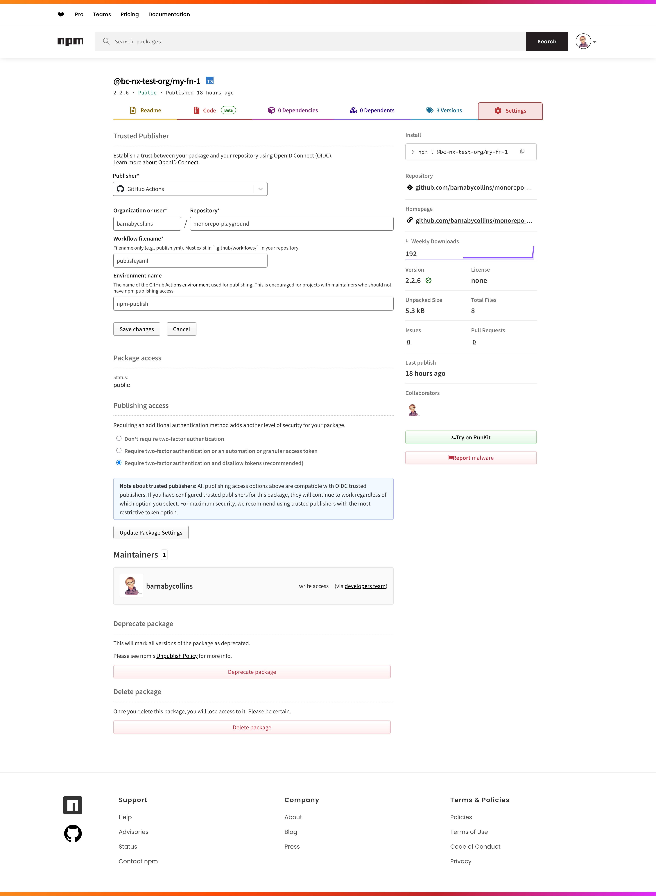

# monorepo-playground

This repository is intended to serve as an MVP implementation of a TypeScript
monorepo using Nx, and building to ESM JS modules with the native TypeScript
compiler (tsc).

## Components in this repository

- Two simple functions in separate packages under `/packages` with unit tests
  using [vitest](https://vitest.dev/)
- An integration test package in `/integration-tests/test-function` which
  imports the two functions and provides an automated test of their combined
  functionality
- MVP configuration for linting, code styling, and TypeScript
- MVP configuration for Nx including linting and TypeScript plugins
- A GitHub workflow that runs on push and uses Nx's features to:
  - Build everything in `/packages`
  - Analyse
    [conventional commit](https://www.conventionalcommits.org/en/v1.0.0/)
    messages to generate changelogs
  - Publishes GitHub Releases and updates `CHANGELOG.md` files for any updated
    packages
  - Pushes the packages to the npm repository using the
    [modern OIDC method](https://docs.npmjs.com/trusted-publishers)

The packages can be found on npm's registry here:

- [@bc-nx-test-org/my-fn-1](https://www.npmjs.com/package/@bc-nx-test-org/my-fn-1)
- [@bc-nx-test-org/my-fn-2](https://www.npmjs.com/package/@bc-nx-test-org/my-fn-2)

The configuration for each package looks like this:

NPM package config

## Not implemented

These jobs are expected to be fairly simple but were deemed to be out of scope
for this spike.

- Pruning source & unit test files before publishing packages
- Pre-commit checks

## Notes

### Testing modules & ESM

I was keen to use ESM for this repository (over CJS) as it is the preferred
option in the ECMAScript standard. However, it turns out that Jest has limited
support for ESM. It can technically be convinced to work with ESM but this
requires more complicated setup and the installation of tools such as babel.
Using TypeScript AND ESM also adds complexity to the Jest setup.

Research indicated that vitest is a popular modern option for testing, and was
commonly chosen by people facing these issues with Jest. It comes with
out-of-the-box support for TypeScript and ESM, and is already in use in GDS:

- [Code search results in govuk-one-login org](https://github.com/search?q=org%3Agovuk-one-login+vitest+path%3A**%2Fpackage.json&type=code)
- [PR search results in govuk-one-login org, including a PR for ongoing work on transitioning to ESM + vitest](https://github.com/search?q=org%3Agovuk-one-login+vitest+-author%3Aapp%2Fdependabot&type=pullrequests)
- [Code search results in alphagov](https://github.com/search?q=org%3Aalphagov+vitest+path%3A**%2Fpackage.json&type=code)

### Hurdles to getting npm publishing working

It took some trial and error to get the GitHub Action to authenticate properly
with npm. The
[OIDC auth process](https://docs.npmjs.com/trusted-publishers#configuring-trusted-publishing)
was actually pretty easy, but there were some things that needed to be fixed in
the workflow. These were:

- Providing a registry argument to the setup-node action
  - I'd assumed it would default to the npm public registry, but looking at the
    [setup-node action docs](https://github.com/actions/setup-node#usage)
    indicated that the setup-node action would only authenticate with the
    registry if you provide this parameter.
- Manually installing npm version 11
  - The current version of the setup-node action seems to install v10 by
    default, but npm docs indicate that we need v11.5.1 or later.
  - Therefore, after setup-node, an additional 'npm install -g npm@11' was
    required
- Setting the `repository` key in `package.json`
  - It turns out that npm expects to be able to read `repository.url` from
    `package.json` when publishing.
  - Setting repository information in all packages resolved this issue.

### Other notes

- The Nx TypeScript plugin likes to have a few `swc` dependencies, presumably to
  help with transpiling. This is why `@swc/core`, `@swc/helpers` and
  `@swc-node/register` are dev dependencies.
- Nx seems to inexplicably use `npm ci --legacy-peer-deps` when releasing.
  - This causes changes to `package-lock.json` that cause following runs of
    `npm ci` without `--legacy-peer-deps` to fail.
  - This can be resolved by overriding the legacy peer deps option with an
    `npm_config_legacy_peer_deps` environment variable set to `false` on the Nx
    release step.
  - See the [relevant GitHub issue](https://github.com/nrwl/nx/issues/22066)
    (and
    [this comment with the env var solution](https://github.com/nrwl/nx/issues/22066#issuecomment-2576366862))
    for more information.
- I was keen to try and avoid the potential for config drift across the
  different packages. To that end, I created all the config files in the root.
  - Most tools (ESLint, prettier etc) iterate up the tree to find the nearest
    config file and use that, so this was no issue for these.
  - However, TypeScript expects a tsconfig against each package, so I created
    symlinks to the root tsconfig.
    - TypeScript does support extending tsconfigs, but having separate tsconfigs
      creates risk that tsconfigs in different packages diverge.
    - Since all our packages should be doing very similar (and not particularly
      complicated) work, I thought a config change in one package makes sense to
      apply to all packages.
    - I don't believe this should affect automated workflows such as the publish
      job, as in my experience changes to files outside packages with `fix` or
      `feat` in the commit message seem to cause that change to be applied to
      all packages.
      - For example, changing `.github/workflows/publish.yaml` with a `fix`
        commit message triggered a patch bump in all published packages.
